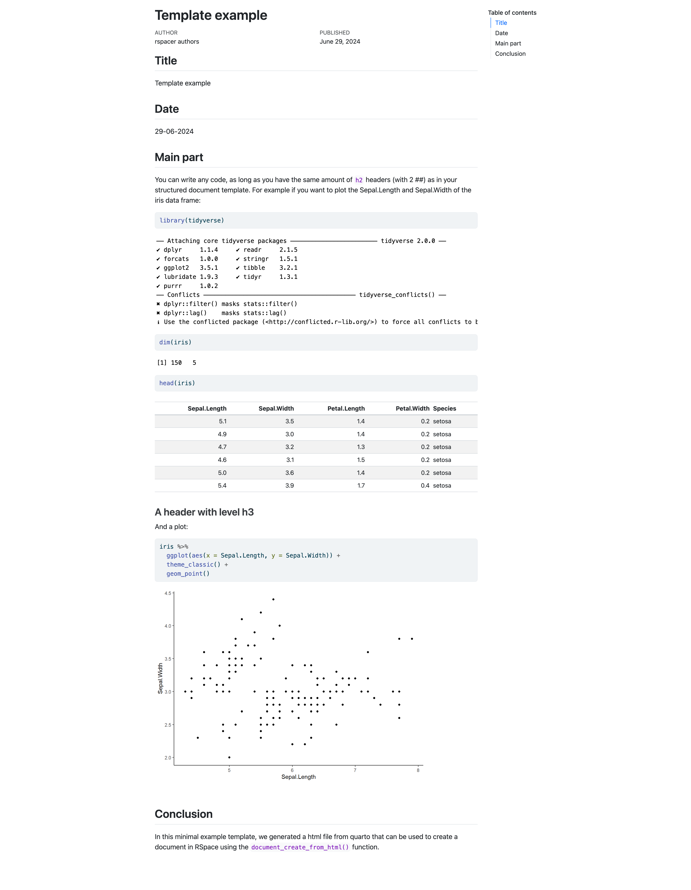
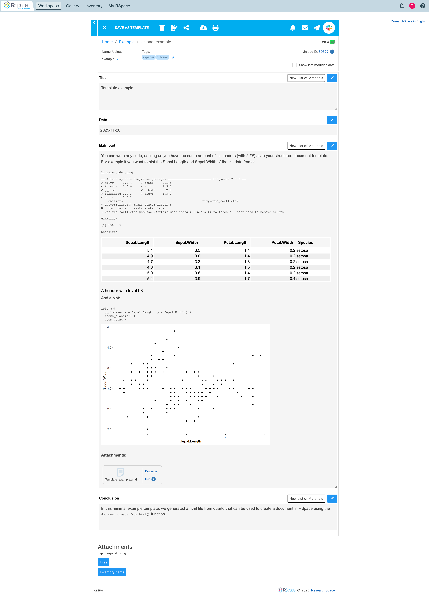

## Rを使う「生物医学系」研究者のあるある問題 {background-color="#2C3E50"}

::: {.incremental}
- 実験データはExcel/Spreadsheetに記録
- 解析はRStudioで実施
- レポートは...Wordで作成？
- メタデータは...手動でコピペ？
- 「あのデータ、どこに保存したっけ？」
:::

::: {.fragment}
### 😫 なんか面倒...
:::

---

## Quartoだけでは解決できない問題 {background-color="#E67E22"}

::: {style="font-size: 0.85em;"}
### ローカルでHTML化するだけならQuartoで十分

::: {.incremental}
- でも、**ラボ内でどうやって共有する？**
  - メールで送る？ → バージョン管理が困難
  - 共有フォルダ？ → 改ざんのリスク
  - GitHub？ → 普段コードを書かない人には敷居が高い
:::

::: {.fragment}

- **改ざん防止**: 誰がいつ変更したか記録が必要
- **文書管理**: 大量のレポートをどう整理・検索するか
- **メタデータ**: 実験条件・サンプル情報との紐付け
:::

::: {.fragment}
### **ELN（電子実験ノート）の導入が必要！**
:::
:::

---

## 研究データ管理の現実 {background-color="#34495E"}

::: {style="font-size: 0.85em;"}
### 増え続ける要求

::: {.columns}
::: {.column width="50%"}
**求められること**

- FAIR原則への準拠
- 再現性の確保
- オープンデータ化
- メタデータの厳密な管理
:::

::: {.column width="50%"}
**現場の声**

- 「時間がない」
- 「ツールが多すぎる」
- 「フローが複雑」
- 「ELN（電子実験ノート）に馴染めない」
:::
:::
:::

---

## ELN導入の最大の壁 {background-color="#E74C3C"}

::: {style="font-size: 0.85em;"}
### 既存の業務フローを壊したくない！

::: {.incremental}
- 研究者はすでに慣れ親しんだツールを使っている
- R + Quarto での解析フローは効率的
- でもELNとの連携が...手作業
- **統合されていないツールは使われない**
:::
:::

---

## RSpace とは？ {background-color="#1ABC9C"}

::: {style="font-size: 0.85em;"}
### 電子実験ノート（ELN）の選択肢

:::: {.columns}
::: {.column width="50%"}
**RSpaceの特徴**

- 🔓 オープンソース（2024年〜）
- 🏗️ 構造化ドキュメント対応
- 🔌 充実したAPI
- 📋 テンプレート機能
- 🔄 バージョン管理
:::

::: {.column width="50%"}
**なぜRSpace？**

- 研究機関での採用実績
- 柔軟なカスタマイズ
- プログラマティックアクセス
- **API経由でR統合が可能！**
:::
::::
:::

---

## rspacer の登場！ {background-color="#27AE60"}

### RSpace API の R ラッパー

::: {.fragment}
```r
library(rspacer)

# たった1行でQuartoレポートをRSpaceへ
document_create_from_html(
  path = "analysis_report.html",
  template_id = "SD377682"
)
```
:::

::: {.fragment}
**これだけで、HTMLレポートが構造化ドキュメントに変換されてアップロード！**
:::

---

## 変換例 {background-color="#9B59B6"}

::: {.columns}
::: {.column width="50%"}

:::

::: {.column width="50%"}

:::
:::

---

## rspacer で何ができる？ {background-color="#3498DB"}

### 3つの主要機能

:::: {.columns}
::: {.column width="33%"}
#### 📥 データ取得
RSpaceからメタデータを直接Rへ
:::

::: {.column width="33%"}
#### 📤 レポート送信
Quarto → RSpace構造化ドキュメント
:::

::: {.column width="33%"}
#### 📊 テーブル変換
Excel/CSV → RSpaceドキュメント
:::
::::

---

## 実例：シングルセル解析 {background-color="#16A085"}

::: {style="font-size: 0.85em;"}
### 実際の研究での活用例

1. **メタデータ取得**: サンプル情報・細胞タイプをRSpaceからダウンロード
2. **データ前処理**: SeuratでQC・正規化
3. **解析・可視化**: 次元削減・クラスタリング・マーカー遺伝子解析
4. **結果アップロード**: Quartoレポート全体をRSpaceへ

::: {.fragment}
### ✨ 全工程がコード化され、完全に再現可能！
:::
:::

---

## Before vs After {background-color="#8E44AD"}

::: {style="font-size: 0.8em;"}
:::: {.columns}
::: {.column width="50%"}
### Before rspacer 😫
1. Rで解析
2. レポート作成
3. Slide/Spreadsheetなどに**手動でコピペ**
4. ファイルを**個別にアップロード**
5. 再現性？ 🤷
:::

::: {.column width="50%"}
### After rspacer 🎉
1. `file_download()` でメタデータ取得
2. Rで解析（同じ）
3. Quarto でレポート作成
4. **`document_create_from_html()`** でアップロード完了！
5. 再現性？ **完璧！**
:::
::::
:::

---

## 技術的な仕組み {background-color="#2C3E50"}

::: {style="font-size: 0.85em;"}
### HTMLからの変換プロセス

```r
# Quarto renders to HTML
# ↓
# rspacer splits by <h2> headers
# ↓
# Each section → RSpace template field
# ↓
# Source .qmd file attached as metadata
```

::: {.fragment}
**フィールド名とヘッダーを一致させるだけでOK！**
:::
:::

---

## なぜrspacerが素晴らしいのか {background-color="#27AE60"}

::: {style="font-size: 0.8em;"}
:::: {.columns}
::: {.column width="50%"}
### 研究者にとって
- ⏱️ 時間の節約
- 🎯 エラーの削減
- 🔄 ワークフローに自然に統合
- 😊 ストレス軽減
:::

::: {.column width="50%"}
### 科学にとって
- ✅ 再現性の向上
- 📊 FAIRデータの実現
- 🌐 データ共有の促進
- 🚀 研究の加速
:::
::::
:::

---

## 実装の容易さ {background-color="#3498DB"}

::: {style="font-size: 0.85em;"}
### インストールから使用まで3ステップ

```r
# 1. インストール
install.packages("rspacer")

# 2. API設定
set_api_url("https://your-instance.researchspace.com/api/v1")
set_api_key("your_api_key")

# 3. 使用開始！
document_create_from_html(
  path = "your_report.html",
  template_id = "SD123456"
)
```
:::

---

## あなたの研究を加速する {background-color="#E74C3C"}

::: {style="font-size: 0.85em;"}
### 今日から始められる！

:::: {.columns}
::: {.column width="50%"}
**やってみよう**
```r
library(rspacer)
vignette("rspacer")
```
:::

::: {.column width="50%"}
**リソース**

- 📖 Paper: [lacdr.github.io/rspacer-manuscript](https://lacdr.github.io/rspacer-manuscript/)
- 💻 GitHub: [github.com/LACDR/rspacer](https://github.com/LACDR/rspacer)
- 📦 CRAN: `install.packages("rspacer")`
:::
::::
:::

---

## {background-color="#27AE60"}

::: {style="text-align: center; font-size: 2.5em; margin-top: 2em;"}
**Enjoy！**
:::

::: {style="text-align: center; font-size: 1.3em; margin-top: 1em;"}
:::

::: {style="text-align: center; font-size: 1em; margin-top: 2em;"}
資料: https://yokoyamtr.github.io/japanr2025/slides.html
:::
